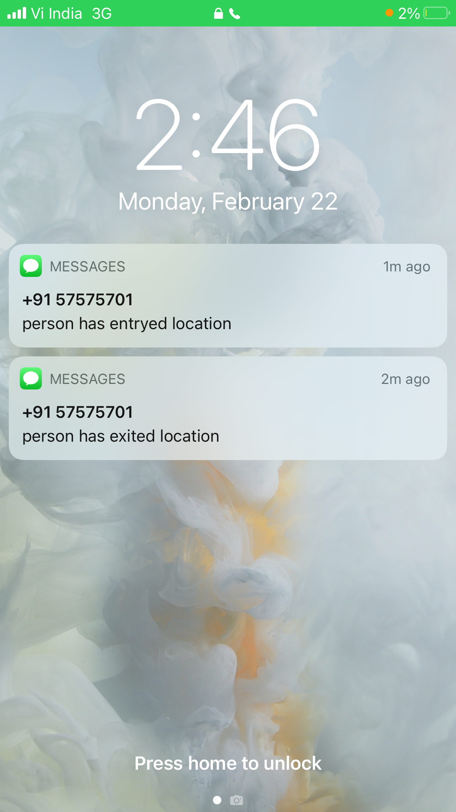

# Hyper-Track Child Safety

## A simple method for parents to monitor the safety and location of their child 

This is a MVP/ POC for a simple application of using HyperTrack services to track the location and monitor safety of children by parents.

We first install the HyperTrack Live app on the child's phone. This can be extended easily to any device capable of providing HyperTrack location data.
It is good to note that the child is not aware of who is tracking, what events are being monitored, when updates/ notifications are send to the parents.

### Details of implementation

1. Install the python requirements using `pip`
2. Then we run the hyper-flask.py file locally currently. 
3. Use something like NGrok to expose a public REST endpoint for the HyperTrack Webooks.
4. Register the Webhook through the free HyperTrack account.
5. Enjoy the security of your most priced posession!

Our python flask server will receive the live location data from HyperTrack (after exposing public endpoint) and monitors certain pre-configured geofences. For eg: when a child enters and leaves the school, home, playground the parent will be notified (currently via SMS)

For configuration and more detailed information viewing, we can, in the future, extend out python server to provide a web-interface to create new endpoints, view trip history, add devices, view satellite images of locations etc. We could also make an app for the parent's phone. 

For local development, I used a tool called NGrok (https://ngrok.com/download) for exposing public REST endpoint for webhooks.
Live location data is received via HyperTrack Webhooks (https://hypertrack.com/docs/guides/stream-locations-and-markers-via-webhooks/)

We create a geofence for important locations in a journey, for eg school, home, playground etc.
(More info about HyperTrack GeoFence https://hypertrack.com/docs/guides/track-arrival-exit-route-to-geofences)

For now, I am storing location updates in GeoJSON format to MongoDB.
In the future the database can be used to provide more information based on trip history in case anomalies in trips are detected.

To provide notifications to parents, I currently use a simple SMS due to the lowest latency.
For now, there is a simple free SMS service which I use called Fast2SMS (https://docs.fast2sms.com/?python#overview)

This can be easily extended to send parents push notifications, emails or a dedicated application on the parent's phone etc.

Here is a sample screenshoot of what happens on my mom's phone, when I leave my home with my phone (a preconfigured GeoFence)

Needless to say, this idea is not limited to parents tracking their kids, but can be extended to a multitude of trip-tracking scenarios. For eg: travel and tourism, adventure sport enthusiasts in remote or dangerous locations, tracking your pet, spying?